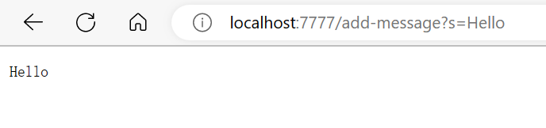

Part1
=======
Here is the code for my StringServer:

```
import java.io.IOException;
import java.net.URI;

class Handler implements URLHandler {
    
    String str = "";

    public String handleRequest(URI url) {

        if(url.getPath().contains("/add-message")){
            
            String[] parameters = url.getQuery().split("=");
            if(parameters[0].equals("s")){
                if(str!=""){
                    str = str + "\n" + parameters[1];
                    return String.format(str);
                }
                str = str + parameters[1];
                return String.format(str);
            }
            return "404 Not Found";
        }
        return "404 Not Found";
    }
}

class StringServer {
    public static void main(String[] args) throws IOException {
        if(args.length == 0){
            System.out.println("Missing port number! Try any number between 1024 to 49151");
            return;
        }

        int port = Integer.parseInt(args[0]);

        Server.start(port, new Handler());
    }
}
```

Screenshot1
-----------




