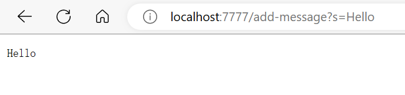
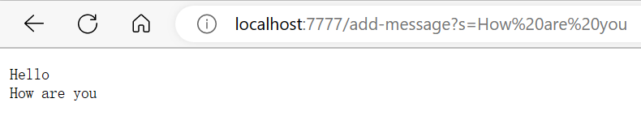

Part1
=======

StringServer Code
-----

Here is the code for my StringServer:

```
import java.io.IOException;
import java.net.URI;

class Handler implements URLHandler {
    
    String str = "";

    public String handleRequest(URI url) {

        if(url.getPath().contains("/add-message")){
            
            String[] parameters = url.getQuery().split("=");
            if(parameters[0].equals("s")){
                if(str!=""){
                    str = str + "\n" + parameters[1];
                    return String.format(str);
                }
                str = str + parameters[1];
                return String.format(str);
            }
            return "404 Not Found";
        }
        return "404 Not Found";
    }
}

class StringServer {
    public static void main(String[] args) throws IOException {
        if(args.length == 0){
            System.out.println("Missing port number! Try any number between 1024 to 49151");
            return;
        }

        int port = Integer.parseInt(args[0]);

        Server.start(port, new Handler());
    }
}
```

Screenshot1
-----------



In this Screenshot, the method **handleRequest()** is called with the url shown in the screenshot.

The relevent argument should be **Server.start(port, new Handler())**.

The relevent values of fields include **str=""**, **url=null**, **parameters[]=null**.

Once the request is made, the value of **url** is changed to **http://localhost:7777/add-message?s=Hello**.

The value of **parameters[]** is changed to **{s, Hello}**. 

The value of **str** is changed to **"Hello"**.

Screenshot2
-----




In this Screenshot, the method **handleRequest()** is called with the url shown in the screenshot.

The relevent argument should be **Server.start(port, new Handler())**.

The relevent values of fields include **str="Hello"**, **url=null**, **parameters[]=null**.

Once the request is made, the value of **url** is changed to **http://localhost:7777/add-message?s=How20%are20%you**.

The value of **parameters[]** is changed to **{s, How are you}**. 

The value of **str** is changed to **"Hello\nHow are you"**.


